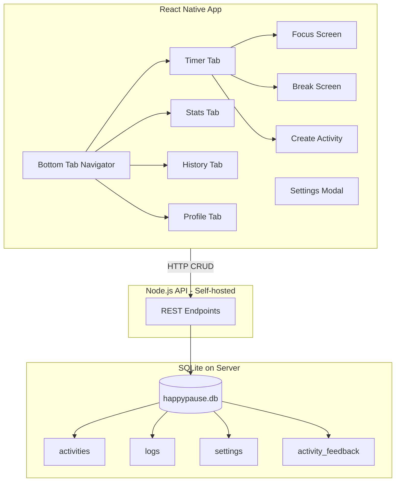

# HappyPause React Native App Plan (v1)

**Overview:** Build HappyPause with a self-hosted Node.js API (SQLite) and a React Native + NativeWind mobile app. The API is the source of truth; the app calls it for CRUD operations. Deployable locally (Docker or bare Node).

---

## Context

HappyPause is a focus-cycle app: work for Y minutes (default 55), take a break for X minutes (default 5), with a random guided activity from 6 categories (FITNESS, LEISURE, SOCIAL, MIND, SPIRITUAL, RELAXATION). The legacy web app ([legacy/](../legacy/)) provides the reference implementation. **Option A**: Self-hosted API + SQLite, no 3rd-party backend.

---

## Tech Stack

| Layer        | Choice                  | Notes                                    |
| ------------ | ----------------------- | ---------------------------------------- |
| **API**      | Node.js + Fastify       | REST CRUD, self-hosted                   |
| **Database** | SQLite (better-sqlite3) | Single `.db` file on server, no Postgres |
| **Mobile**   | Expo (React Native)     | Cross-platform                           |
| **Styling**  | NativeWind v4           | Tailwind for RN                          |
| **Auth**     | JWT in API (Phase 2)    | Self-hosted, no Supabase                 |

---

## Architecture Overview



---

## Phase 1: Foundation (MVP)

### 1.1 API Setup (Backend)

- Create `backend/` folder with Node.js + Fastify
- Install: `fastify`, `better-sqlite3`, `@fastify/cors`, `@fastify/static`
- SQLite DB file: `backend/data/happypause.db` (or env `DB_PATH`)
- Run: `node backend/server.js` or `npm run api`
- Deploy: Docker (optional) or `node server.js` on VPS/local

### 1.2 API Endpoints (CRUD)

| Method | Endpoint                   | Description                                             |
| ------ | -------------------------- | ------------------------------------------------------- |
| GET    | `/activities`              | List activities (filter by category)                    |
| GET    | `/activities/next`         | Weighted random activity (query params: categories, device_id) |
| PATCH  | `/activities/:id/feedback` | Thumbs up/down, last_shown                              |
| POST   | `/activities`              | Create custom activity                                  |
| GET    | `/logs`                    | List logs (paginated)                                   |
| POST   | `/logs`                    | Create log entry                                        |
| GET    | `/stats`                   | Aggregated stats (total focus/pause, weekly chart, category breakdown) |
| GET    | `/settings`                | Get settings by device_id (from `X-Device-ID`); returns default values if no row exists |
| PUT    | `/settings`                | Update settings                                         |
| GET    | `/images/:filename`        | Static serve activity icons from `backend/public/images/` |

### 1.3 SQLite Schema & Seeding (API)

**Tables:**

- `activities` — id (TEXT 12-digit), category, title, description, icon_path, info_url, creator_id, creator_name, is_custom (0/1)
- `activity_feedback` — activity_id, thumbs_up, thumbs_down, last_shown_at
- `logs` — id, timestamp, type, activity_id, category, activity_name, duration, user_id (nullable)
- `settings` — user_id/device_id, focus_duration, pause_duration, visible_categories (JSON), ringtone, language
- `custom_activities` — same as activities + is_public, pending_approval

**Seeding:**

- Node script: read [HappyPause-Activities.csv](HappyPause-Activities.csv) → insert into SQLite
- Run `npm run seed` on first deploy
- Map CSV: CATEGORY (1–6) → name, IMAGE → `{CATEGORY}-{ID}.png` per [naming logic](happypausedevisrprompts.txt)

### 1.4 Mobile App Setup

- Create Expo app: `npx create-expo-app@latest happypause-app --template blank-typescript`
- Install NativeWind v4, react-navigation, react-native-screens, react-native-safe-area-context
- Configure `tailwind.config.js`, `global.css`, babel, metro per [NativeWind docs](https://www.nativewind.dev/quick-starts/react-native-cli)
- Apply theme: `#36333a` (charcoal), `#b1b7a2` (sage), `#f5f5f5` (off-white)
- API base URL: env `EXPO_PUBLIC_API_URL` (e.g. `http://localhost:3000` for dev)
- **Device ID**: Generate UUID on first launch, store in AsyncStorage, send in `X-Device-ID` header on every API request

### 1.5 Core Screens (4 Tabs)

- **Phase 1 auth**: No login screen; app opens directly to main tabs with device_id (guest mode)

| Tab     | Screen        | Key Components                                                                     |
| ------- | ------------- | ---------------------------------------------------------------------------------- |
| Timer   | Focus + Break | Circular progress (SVG or react-native-svg), countdown, "Have a HappyPause" button |
| Stats   | StatsTab      | Total focus/pause time, weekly chart, category breakdown                           |
| History | HistoryTab    | Chronological log (focus_started, happypause_done, etc.)                           |
| Profile | ProfileTab    | Profile card, settings link, logout (local only for Phase 1)                       |

### 1.6 Timer Flow

- **Focus screen**: Countdown from Y, circular progress ring, "Ends at HH:MM", "Have a HappyPause" button
- **Break screen**: Random activity from enabled categories, thumbs up/down, Cycle/Done/Skip, tap circle → open infoUrl (Linking.openURL or WebBrowser)
- **Weighted selection**: Port logic from [legacy/services/dataService.ts](../legacy/services/dataService.ts) — BaseWeight, thumbs multiplier, anti-repetition (last 3 breaks, within 2h). Include both `activities` and `custom_activities` (for the creator's device_id) in the pool.
- **Ringtone**: At focus end, play sound (expo-av); store selection in settings

### 1.7 Settings Modal

- Ringtone dropdown, category checkboxes, focus/pause duration
- Persist via `PUT /settings` (API)

### 1.8 Create Activity Form

- Category dropdown, name, description, icon (image picker or URL), info URL
- Checkboxes: "Make public", "I agree to Terms"
- Submit via `POST /activities` (API)

### 1.9 Images

- API serves static files via `GET /images/:filename` (e.g. `@fastify/static` pointing to `backend/public/images/`)
- App fetches via `{API_URL}/images/{CATEGORY}-{id}.png`
- For user-created: upload to API or store URL in DB

### 1.10 Error Handling (Network)

- API client: retry on failure (e.g. 2 retries with backoff)
- On persistent failure: show "Cannot connect" message to user

---

## Phase 2: Auth & Email (Post-MVP)

- **JWT Auth** in API: register, login, refresh token
- **Forgot password**: Email codes via Resend or SMTP (self-hosted)
- **Public activity approval**: Admin endpoint to approve "make public" activities
- **User-scoped data**: settings, logs tied to `user_id` instead of device_id

---

## File Structure (Proposed)

```
Happypause/
├── backend/                 # Node.js API
│   ├── server.js
│   ├── routes/
│   │   ├── activities.js
│   │   ├── logs.js
│   │   ├── stats.js
│   │   └── settings.js
│   ├── db/
│   │   ├── database.js       # better-sqlite3 init
│   │   ├── schema.sql
│   │   └── seed.js          # CSV → SQLite
│   ├── data/
│   │   └── happypause.db    # SQLite file (gitignored or committed seeded)
│   └── package.json
│
├── app/                     # Mobile (Expo)
│   ├── (tabs)/
│   │   ├── index.tsx       # Timer
│   │   ├── stats.tsx
│   │   ├── history.tsx
│   │   └── profile.tsx
│   └── _layout.tsx
├── components/
├── services/                # API client (fetch)
│   ├── api.ts              # base URL, fetch wrappers
│   ├── activityService.ts
│   ├── logService.ts
│   ├── statsService.ts
│   └── settingsService.ts
├── types/
├── assets/
└── ...
```

---

## Phase 1: Implementation Choices (Option 1)

| Gap | Choice |
|-----|--------|
| **Device ID** | UUID on first launch, AsyncStorage, `X-Device-ID` header |
| **Default settings** | API returns default values when no row exists for device_id |
| **Stats** | `GET /stats` endpoint aggregates from logs server-side |
| **Images** | API serves static files via `GET /images/:filename` |
| **Custom activities** | Included in weighted selection for the creator's device_id |
| **Login Phase 1** | No login screen; app opens directly with device_id (guest mode) |
| **Error handling** | Retry + "Cannot connect" message |

---

## Key Implementation Notes

1. **Legacy reference**: Use [legacy/views/TimerTab.tsx](../legacy/views/TimerTab.tsx), [legacy/services/dataService.ts](../legacy/services/dataService.ts), and [legacy/types.ts](../legacy/types.ts) for logic and types.
2. **Weighted selection**: Implement in API (`GET /activities/next`) — port logic from legacy dataService (BaseWeight, thumbs multiplier, anti-repetition).
3. **Offline**: App requires network for data. Optional Phase 2: cache in AsyncStorage or expo-sqlite for offline fallback.
4. **CORS**: Enable `@fastify/cors` for mobile dev (localhost) and production.
5. **Deployment**: `node backend/server.js`; or Docker with `CMD ["node", "server.js"]` and volume for `data/happypause.db`.

---

## Out of Scope for Phase 1

- Real login/sign-in (use device_id or guest mode)
- Email delivery
- Public activity approval
- Offline-first caching
